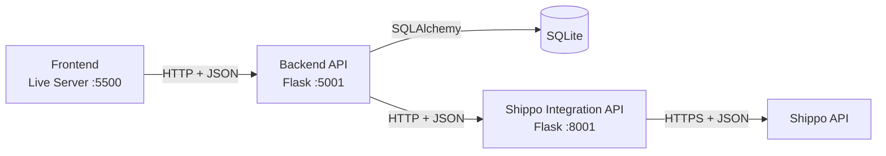

# Hydrogen Generator API (Backend)

Backend REST API for managing:
- Customers
- Hydrogen generators
- Customer-generator links (assets)

The project is built with Flask, OpenAPI (flask-openapi3), SQLAlchemy, and SQLite.

For component boundaries, domain models, request sequences, payload examples,
and failure flows, see
[SPECIFIC_ARCHITECTURE.md](SPECIFIC_ARCHITECTURE.md).

## Project Overview

This API provides CRUD operations for the MVP domain and exposes interactive OpenAPI documentation.

Main features:
- Create, list, search, and delete customers
- Create, list, search, and delete hydrogen generators
- Create, list, search, and delete customer-generator links
- Validate and normalize US postal addresses through the integration service
- Request shipping quotes without owning provider credentials or protocols
- Input validation via Pydantic schemas
- Structured logging to console and rotating file logs

## Current Architecture



The frontend supplies origin, destination, generator ID, and quantity. The
backend retrieves trusted generator dimensions and weight from SQLite, applies
the product-specific freight rule, creates one parcel per generator, and sends
`address_from`, `address_to`, and `parcels` to the integration API. Only the
integration API knows Shippo credentials, provider paths, retry policy, and raw
provider response formats.

## Container Deployment

The container runs `app:app` with Gunicorn on port `5001`. Its liveness check
calls `GET /health` locally and does not contact the integration service or
Shippo. Compose publishes the backend on host port `5001` by default and sets
`SHIPPO_INTEGRATION_BASE_URL=http://shippo-integration:8001` for private
service-to-service traffic.

SQLite data is stored in the `backend-data` named volume, mounted only at
`/app/database`. File logging is disabled in Compose so operational logs flow
to container standard output. The stack definition is maintained in
[the external API repository](../SoftwareArchitecture_API_External/docker-compose.yml).
See [the containerization guide](../CONTAINERIZATION.md) for operation and port
overrides.

## Backend-Frontend Route Mapping

| Domain | Route | Frontend usage |
|---|---|---|
| Customers | `POST /customer` | **Register Customer** form |
| Customers | `PUT /customer?customer_id=...` | **Edit customer** action |
| Customers | `GET /customers` | **List All** button |
| Customers | `GET /customer?customer_id=...` | **Search** button |
| Customers | `DELETE /customer?customer_id=...` | Delete action |
| Generators | `POST /hydrogen-generator` | **Register Generator** form |
| Generators | `PUT /hydrogen-generator?serial_number=...` | **Edit generator** action |
| Generators | `GET /hydrogen-generators` | **List All** button |
| Generators | `GET /hydrogen-generator?serial_number=...` | **Search** button |
| Generators | `DELETE /hydrogen-generator?serial_number=...` | Delete action |
| Relationships | `POST /asset` | **Create Relationship** form |
| Relationships | `PUT /asset?asset_id=...` | **Edit relationship** action |
| Relationships | `GET /assets` | **List All** button |
| Relationships | `GET /asset?asset_id=...` | **Search** button |
| Relationships | `DELETE /asset?asset_id=...` | Delete action |
| Address validation | `POST /validate-address` | API-only operation |
| Shipping | `POST /shipping-quote` | **Calculate Shipping Cost** button |

Address validation does not read or write the application database.

## Tech Stack

- Python
- Flask
- flask-openapi3 (Swagger/ReDoc/RapiDoc)
- SQLAlchemy + SQLAlchemy-Utils
- SQLite (local file database)

## Prerequisites

Before running the project, install:

1. **Python 3.10+** (recommended 3.11 or newer)
2. **update pip** (usually included with Python)
3. (Optional but recommended) **venv** for isolated dependencies

To verify Python installation:

```bash
python --version
```

## Installation

From the backend folder (`SoftwareArchitecture_Back_End_API`):

1. Create virtual environment:

```bash
python -m venv .venv
```

2. Activate virtual environment:

- **Windows (PowerShell)**

```powershell
& ".\.venv\Scripts\Activate.ps1"
```

- **Linux / macOS**

```bash
source .venv/bin/activate
```

3. Install dependencies:

```bash
pip install -r requirements.txt
```

## Basic Configuration

The backend communicates with the separately running integration service over
HTTP. Copy `.env.example` to a backend-local `.env` and configure:

```dotenv
SHIPPO_INTEGRATION_BASE_URL=http://127.0.0.1:8001
SHIPPO_INTEGRATION_CONNECT_TIMEOUT_SECONDS=3.05
SHIPPO_INTEGRATION_READ_TIMEOUT_SECONDS=30
```

The backend must not contain Shippo credentials. Provider authentication,
provider endpoints, retries, and response parsing belong to
`SoftwareArchitecture_API_External`. Origin and destination are supplied per
request. In a future Docker network, the base
URL could instead be `http://shippo-integration:8001`.

On startup, the system automatically:
- Creates the `database/` folder (if missing)
- Creates `database/db.sqlite3` (if missing)
- Creates database tables from SQLAlchemy models
- Creates log directory `logs/h2_system/` and log file `activity.log`

## Running the API

Start the complete application in this order:

1. Start `SoftwareArchitecture_API_External` on port `8001`:

```powershell
cd ..\SoftwareArchitecture_API_External
& ".\.venv\Scripts\Activate.ps1"
python app.py
```

2. Start this backend on port `5001`:

```powershell
cd ..\SoftwareArchitecture_Back_End_API
& ".\.venv\Scripts\Activate.ps1"
python app.py
```

3. Open the frontend with VS Code Live Server on
	`http://127.0.0.1:5500`.

### Linux: Run with Gunicorn

On Linux, the backend can run with Gunicorn instead of Flask's development
server. Activate the backend virtual environment, ensure the integration API
and backend `.env` configuration are available, then run:

```bash
source .venv/bin/activate
gunicorn --bind 0.0.0.0:5001 --workers 1 --threads 4 --timeout 60 app:app
```

This standalone Gunicorn command is intended for Linux environments. For local
development on Windows, use `python app.py` as described above.

Service URLs:

- Frontend: `http://127.0.0.1:5500`
- Backend: `http://127.0.0.1:5001`
- Integration API: `http://127.0.0.1:8001`


## API Documentation

After starting the server, open in your browser:

- Swagger UI: `http://127.0.0.1:5001/openapi`

The root path `/` redirects to the OpenAPI docs.


## Route Reference

All endpoints are available under the same base URL:

- `http://127.0.0.1:5001`

### 1) Home / Docs

#### `GET /`
- **Description:** Redirects to the OpenAPI page.
- **Request:** No body, no query params.
- **Response:** HTTP redirect to `/openapi`.
- **Status codes:**
	- `302` Redirect

### 2) Customers

#### `POST /customer`
- **Description:** Creates a new customer.
- **Request (form-data):**
	- `name` (string)
	- `email` (string, valid email)
	- `tx_id` (string, format `000-00-0000`)
- **Success response (`200`):**
	- `customer_id` (int)
	- `name` (string)
	- `email` (string)
	- `tx_id` (string)
- **Status codes:**
	- `200` Created/saved successfully
	- `409` Duplicate data conflict
	- `400` Unexpected save error

#### `GET /customers`
- **Description:** Returns all customers.
- **Request:** No body, no query params.
- **Success response (`200`):**
	- `{ "customers": [ ... ] }` where each item is:
		- `customer_id`, `name`, `email`, `tx_id`
- **Status codes:**
	- `200` Always returns list (can be empty)

#### `GET /customer?customer_id=<id>`
- **Description:** Returns one customer by ID.
- **Request (query):**
	- `customer_id` (int > 0)
- **Success response (`200`):**
	- `customer_id`, `name`, `email`, `tx_id`
- **Status codes:**
	- `200` Found
	- `404` Not found

#### `DELETE /customer?customer_id=<id>`
- **Description:** Deletes a customer by ID (and related asset links).
- **Request (query):**
	- `customer_id` (int > 0)
- **Success response (`200`):**
	- `message` (string)
	- `customer_id` (int)
- **Status codes:**
	- `200` Deleted
	- `404` Not found

### 3) Hydrogen Generators

#### `POST /hydrogen-generator`
- **Description:** Creates a new hydrogen generator.
- **Request (form-data):**
	- `serial_number` (string, format `GEN-0000`)
	- `acquisition_type` (string: `Leasing | Renting | Direct Sales`)
	- `stack_type` (string: `PEMFC | Alcaline | SOFC | AEMFC | Other/Personalized`)
	- `number_of_cells` (int, 1..5000)
	- `stack_voltage` (float, >0 and <=2000)
	- `current_density` (float, >0 and <=5000)
	- `length_in`, `width_in`, `height_in` (float, >0; unit dimensions in inches)
	- `weight_lb` (float, >0; unit weight in pounds)
- **Success response (`200`):**
	- `generator_id`, `serial_number`, `acquisition_type`, `stack_type`,
		`number_of_cells`, `stack_voltage`, `current_density`,
		`length_in`, `width_in`, `height_in`, `weight_lb`
- **Status codes:**
	- `200` Created/saved successfully
	- `409` Duplicate serial number
	- `400` Unexpected save error

#### `GET /hydrogen-generators`
- **Description:** Returns all hydrogen generators.
- **Request:** No body, no query params.
- **Success response (`200`):**
	- `{ "generators": [ ... ] }` where each item contains generator fields
- **Status codes:**
	- `200` Always returns list (can be empty)

#### `GET /hydrogen-generator?serial_number=<serial>`
- **Description:** Returns one generator by serial number.
- **Request (query):**
	- `serial_number` (string; supported for lookup)
- **Success response (`200`):**
	- `generator_id`, `serial_number`, `acquisition_type`, `stack_type`,
		`number_of_cells`, `stack_voltage`, `current_density`,
		`length_in`, `width_in`, `height_in`, `weight_lb`
- **Status codes:**
	- `200` Found
	- `404` Not found
	- `422` Query validation error

#### `DELETE /hydrogen-generator?serial_number=<serial>`
- **Description:** Deletes one generator by serial number.
- **Request (query):**
	- `serial_number` (string, **must match `GEN-0000`** for deletion)
- **Success response (`200`):**
	- `message` (string)
	- `serial_number` (string)
- **Status codes:**
	- `200` Deleted
	- `400` Invalid serial format for deletion
	- `404` Not found
	- `422` Query validation error

### 4) Customer-Generator Links (Assets)

#### `POST /asset`
- **Description:** Creates a link between a customer and a generator.
- **Request (form-data):**
	- `customer_id` (int > 0)
	- `generator_id` (int > 0)
	- `generator_qtd` (int, 1..10000)
	- `installation_date` (optional datetime)
- **Success response (`200`):**
	- `asset_id`, `customer_id`, `generator_id`, `generator_qtd`, `installation_date`
- **Status codes:**
	- `200` Created/saved successfully
	- `404` Referenced customer or generator not found
	- `409` Data conflict
	- `400` Unexpected save error

#### `GET /assets`
- **Description:** Returns all asset links.
- **Request:** No body, no query params.
- **Success response (`200`):**
	- `{ "assets": [ ... ] }` where each item contains asset fields
- **Status codes:**
	- `200` Always returns list (can be empty)

#### `GET /asset?asset_id=<id>`
- **Description:** Returns one asset link by ID.
- **Request (query):**
	- `asset_id` (int > 0)
- **Success response (`200`):**
	- `asset_id`, `customer_id`, `generator_id`, `generator_qtd`, `installation_date`
- **Status codes:**
	- `200` Found
	- `404` Not found

#### `DELETE /asset?asset_id=<id>`
- **Description:** Deletes one asset link by ID.
- **Request (query):**
	- `asset_id` (int > 0)
- **Success response (`200`):**
	- `message` (string)
	- `asset_id` (int)
- **Status codes:**
	- `200` Deleted
	- `404` Not found
	- `400` Unexpected delete error

## Notes

### 5) Address Validation

#### `POST /validate-address`
- **Description:** Validates and normalizes one US postal address through the internal integration API.
- **Request (JSON):**
	- `customer_name` (string)
	- `street1` (string)
	- `city` (string)
	- `state` (two-letter code)
	- `zip_code` (ZIP or ZIP+4)
- **Success response (`200`):**
	- `success` (boolean)
	- `valid` (boolean)
	- `normalized_zip` (string or null)
	- `is_residential` (boolean or null)
	- `messages` (provider message list)
- **Status codes:**
	- `200` Address processed, whether valid or invalid
	- `500` Unexpected server failure
	- `502` Integration service or response failure
	- `503` Integration service configuration unavailable
	- `504` Integration service request timeout
- This operation does not read or write the local database.

### 6) Shipping Quotes

#### `POST /shipping-quote`
- **Description:** Calculates a quote for a stored generator and quantity.
- **Request (JSON):**
	- origin name, street, city, two-letter state, and ZIP
	- recipient name and destination street, city, two-letter state, and ZIP
	- `generator_id` (int > 0)
	- `generator_quantity` (int, 1..100)
- **Calculation:** The backend loads dimensions and weight from SQLite, applies
  the freight rule, and creates one parcel per requested generator. It forwards
  both addresses and the parcels to the integration API.
- **Status codes:**
	- `200` Quote calculation completed
	- `404` Generator not found
	- `500` Unexpected server or database failure
	- `502` Integration service or response failure
	- `503` Integration service configuration unavailable
	- `504` Integration service request timeout

Incoming `X-Correlation-ID` values are forwarded to the integration service and
echoed on backend responses. When omitted, the backend generates an identifier
for the complete request flow.

`shippo_messages` is always a list of normalized objects:

```json
{
	"source": "Carrier or Shippo",
	"message": "Normalized provider message"
}
```

## Automated Tests

Run the backend suite from this repository:

```powershell
& ".\.venv\Scripts\Activate.ps1"
python -m unittest discover -s tests -v
```

- The frontend project should call this API at `http://127.0.0.1:5001`.
- Tables are not auto-populated; user action is required to display data.
- The **Clear Table** button only clears the table view, not the database.
- Some validations are intentionally strict (for example, generator serial format).
- Logs are written to `logs/h2_system/activity.log`.
