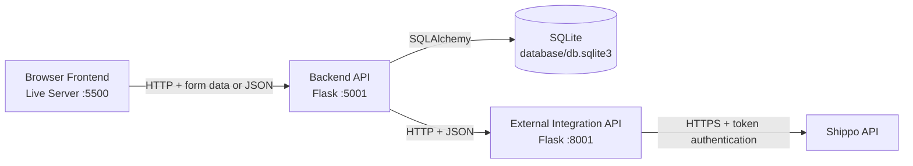
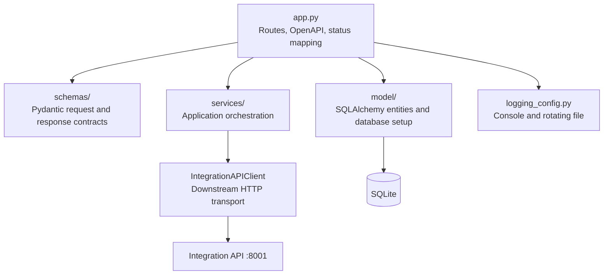
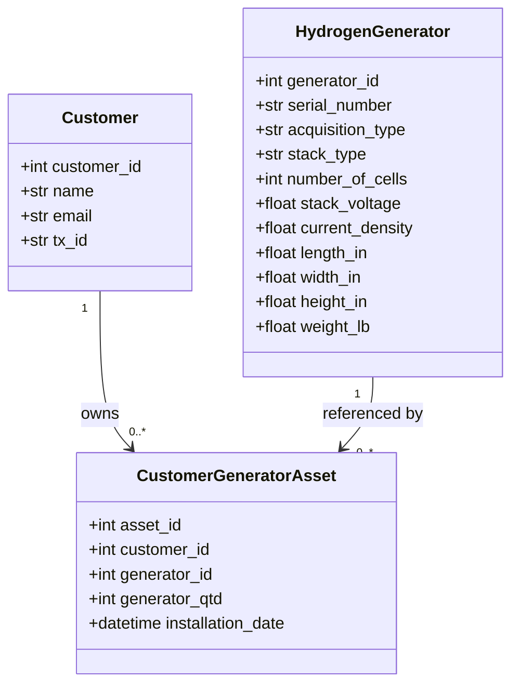
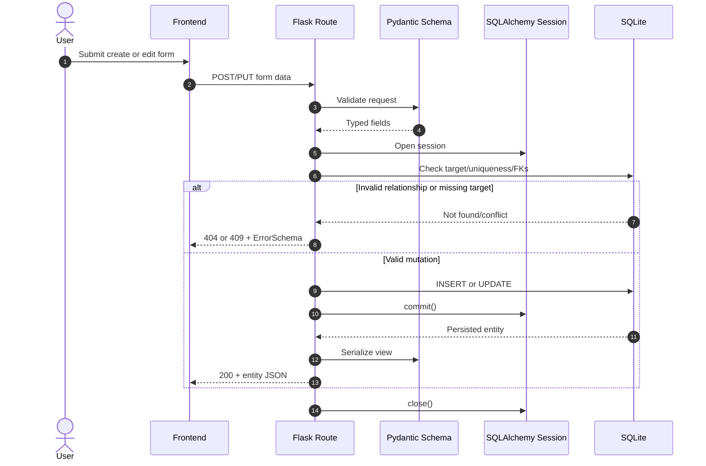
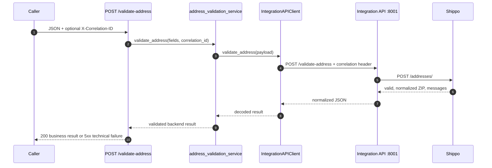
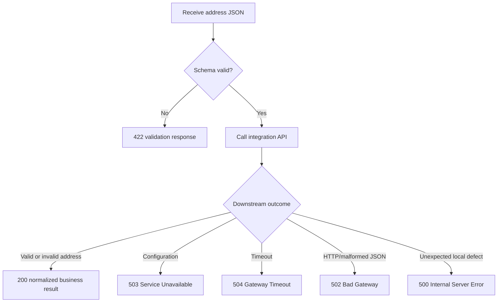
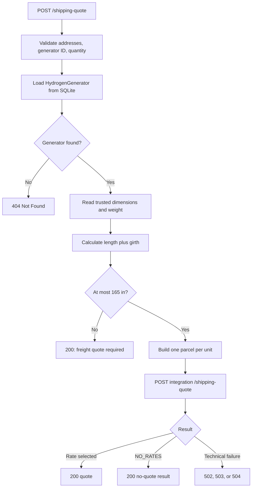
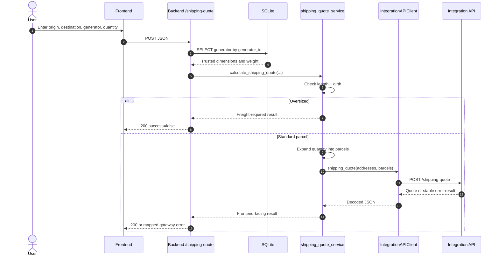
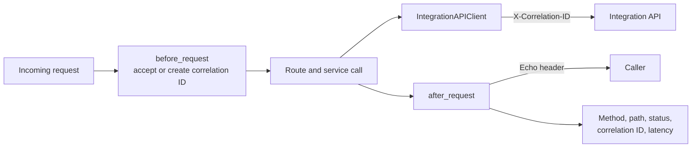

# Backend API Architecture

## 1. Purpose and Scope

`SoftwareArchitecture_Back_End_API` is the system's application and business API.
It runs on `http://127.0.0.1:5001`, exposes the domain CRUD operations used by
the browser, owns the SQLite database, and orchestrates shipping operations
through `SoftwareArchitecture_API_External`.

The backend owns:

- Customer, hydrogen generator, and customer-generator relationship data.
- Validation of application-facing request contracts.
- Database transactions, uniqueness checks, and relationship integrity.
- Trusted generator dimensions and weight.
- The standard-parcel versus freight decision.
- Conversion of a generator and quantity into Shippo-compatible parcels.
- Mapping integration failures into stable HTTP responses.

The backend does not own:

- Browser rendering or UI state.
- Shippo credentials, provider URLs, retries, or raw provider responses.
- Direct carrier communication.
- Address persistence. Address validation is a stateless proxy operation.

## 2. Architectural Context



The browser is the backend's public application client. The integration API is
an internal downstream service. Neither adjacent repository is imported as a
Python package; communication occurs through HTTP contracts.

## 3. Layered Structure



| Layer | Main files | Responsibility |
|---|---|---|
| HTTP adapter | `app.py` | Route registration, request context, sessions, commits, rollbacks, response statuses |
| Contract | `schemas/*.py` | Pydantic validation and JSON serialization helpers |
| Application services | `services/address_validation_service.py`, `services/shipping_quote_service.py` | Integration result validation and shipping policy |
| Integration client | `services/integration_api_client.py` | Downstream URL/configuration, timeout handling, JSON decoding, correlation forwarding |
| Domain persistence | `model/*.py` | SQLAlchemy mappings and relationships |
| Infrastructure | `model/database.py`, `logging_config.py` | SQLite initialization, legacy column migration, structured operational logs |

## 4. HTTP API Surface

CRUD bodies are submitted as form data by the current frontend. Shipping and
address-validation bodies are JSON. Query parameters identify records for
single-resource reads, updates, and deletes.

| Method | Route | Input | Primary result |
|---|---|---|---|
| `GET` | `/` | None | Redirect to `/openapi` |
| `POST` | `/customer` | Customer form | Created customer |
| `GET` | `/customer?customer_id={id}` | Query | One customer |
| `GET` | `/customers` | None | Customer collection |
| `PUT` | `/customer?customer_id={id}` | Query + customer form | Updated customer |
| `DELETE` | `/customer?customer_id={id}` | Query | Deletion confirmation |
| `POST` | `/hydrogen-generator` | Generator form | Created generator |
| `GET` | `/hydrogen-generator?serial_number={serial}` | Query | One generator |
| `GET` | `/hydrogen-generators` | None | Generator collection |
| `PUT` | `/hydrogen-generator?serial_number={serial}` | Query + generator form | Updated generator |
| `DELETE` | `/hydrogen-generator?serial_number={serial}` | Query | Deletion confirmation |
| `POST` | `/asset` | Relationship form | Created relationship |
| `GET` | `/asset?asset_id={id}` | Query | One relationship |
| `GET` | `/assets` | None | Relationship collection |
| `PUT` | `/asset?asset_id={id}` | Query + relationship form | Updated relationship |
| `DELETE` | `/asset?asset_id={id}` | Query | Deletion confirmation |
| `POST` | `/validate-address` | JSON address | Normalized validation result |
| `POST` | `/shipping-quote` | JSON addresses and generator selection | Quote or no-quote business result |

Framework-level schema failures normally return `422`. Domain conflicts return
`409`, missing records return `404`, and unexpected local failures return `400`
or `500` according to the route boundary.

## 5. Domain and Persistence Model



`CustomerGeneratorAsset` is an association entity with its own payload. It
represents how many units of one generator are associated with one customer and
when that relationship was installed.

Key invariants include:

- Customer email and tax ID are unique.
- Generator serial number is unique and uses the `GEN-0000` convention.
- Relationship foreign keys must identify existing records.
- Generator quantity is positive and no greater than 10,000.
- Generator physical values are positive and constrained by schema limits.
- Deleting a customer or generator removes dependent relationship records.

The database module creates missing tables at startup. It also adds legacy
shipping columns to older development databases when necessary. This is a
small compatibility migration mechanism, not a general migration framework.

## 6. Schema Model

```mermaid
classDiagram
    class CustomerSchema
    class CustomerSearchSchema
    class CustomerViewSchema
    class CustomerListSchema
    class HydrogenGeneratorCreateSchema
    class HydrogenGeneratorSearchSchema
    class HydrogenGeneratorViewSchema
    class HydrogenGeneratorListSchema
    class CustomerGeneratorAssetSchema
    class CustomerGeneratorAssetSearchSchema
    class AddressValidationSchema
    class AddressValidationResponseSchema
    class ShippingQuoteSchema
    class ShippingQuoteResponseSchema
    class ErrorSchema

    CustomerSchema ..> CustomerViewSchema : create/update produces
    CustomerSearchSchema ..> CustomerViewSchema : identifies
    HydrogenGeneratorCreateSchema ..> HydrogenGeneratorViewSchema : create/update produces
    HydrogenGeneratorSearchSchema ..> HydrogenGeneratorViewSchema : identifies
    CustomerGeneratorAssetSchema ..> CustomerGeneratorAssetSearchSchema : managed by ID
    AddressValidationSchema ..> AddressValidationResponseSchema : produces
    ShippingQuoteSchema ..> ShippingQuoteResponseSchema : produces
    ErrorSchema <.. AddressValidationResponseSchema : route failure
    ErrorSchema <.. ShippingQuoteResponseSchema : route failure
```



Response helper functions in the entity schema modules translate ORM objects
into public dictionaries. This keeps SQLAlchemy internals out of HTTP response
construction.

## 7. CRUD Transaction Flow



On a database exception, the route rolls back the transaction before closing
the session. Read and mutation paths use short-lived sessions rather than
sharing a global transaction.

### Customer create example

```http
POST /customer
Content-Type: multipart/form-data

name=Acme Corporation
email=contact@example.com
tx_id=123-45-6789
```

```json
{
  "customer_id": 42,
  "name": "Acme Corporation",
  "email": "contact@example.com",
  "tx_id": "123-45-6789"
}
```

## 8. Address Validation Architecture

Address validation is available as an API operation, but it is not currently a
standalone frontend screen. It does not access SQLite.



### Backend request

```json
{
  "customer_name": "Acme Corporation",
  "street1": "123 Main Street",
  "city": "Atlanta",
  "state": "GA",
  "zip_code": "30301"
}
```

### Completed validation result

```json
{
  "success": true,
  "valid": true,
  "normalized_zip": "30301-1234",
  "is_residential": false,
  "messages": []
}
```

An invalid real-world address is a completed business result and can still use
HTTP `200`. Transport, configuration, timeout, and malformed-response failures
use gateway-oriented statuses.



## 9. Shipping Quote Architecture

The shipping route accepts addresses plus `generator_id` and quantity. It does
not trust dimensions supplied by the browser. The route loads measurements from
SQLite and passes those trusted values to the shipping service.

For dimensions sorted as longest side $L$ and remaining sides $W$ and $H$, the
parcel rule is:

$$
\text{length plus girth} = L + 2(W + H) \le 165\text{ inches}
$$

Each selected generator becomes one parcel. Therefore, a quantity $q$ produces
$q$ identical parcel objects rather than one parcel whose weight is multiplied.





### Frontend-to-backend request

```json
{
  "origin_name": "West Coast Warehouse",
  "origin_street": "100 Manufacturing Way",
  "origin_city": "Torrance",
  "origin_state": "CA",
  "origin_zip": "90501",
  "customer_name": "Acme Corporation",
  "destination_street": "123 Main Street",
  "destination_city": "Atlanta",
  "destination_state": "GA",
  "destination_zip": "30301",
  "generator_id": 7,
  "generator_quantity": 2
}
```

### Backend-to-integration request

```json
{
  "address_from": {
    "name": "West Coast Warehouse",
    "street1": "100 Manufacturing Way",
    "city": "Torrance",
    "state": "CA",
    "zip": "90501",
    "country": "US"
  },
  "address_to": {
    "name": "Acme Corporation",
    "street1": "123 Main Street",
    "city": "Atlanta",
    "state": "GA",
    "zip": "30301",
    "country": "US"
  },
  "parcels": [
    {
      "length": "24.0",
      "width": "16.0",
      "height": "12.0",
      "distance_unit": "in",
      "weight": "50.0",
      "mass_unit": "lb"
    },
    {
      "length": "24.0",
      "width": "16.0",
      "height": "12.0",
      "distance_unit": "in",
      "weight": "50.0",
      "mass_unit": "lb"
    }
  ]
}
```

## 10. Error and Response Mapping

| Condition | Backend status | Meaning |
|---|---:|---|
| Successful CRUD or quote | `200` | Operation completed |
| Invalid address or no available rate | `200` | Completed business outcome; inspect body |
| Framework request validation | `422` | Request contract is invalid |
| Local business/request error | `400` | Route-specific invalid operation |
| Missing database entity | `404` | Requested resource does not exist |
| Uniqueness or integrity conflict | `409` | Mutation conflicts with stored data |
| Downstream response/HTTP failure | `502` | Integration result could not be trusted |
| Downstream configuration failure | `503` | Integration service cannot perform the operation |
| Downstream timeout | `504` | Integration operation exceeded its timeout |
| Unexpected backend failure | `500` | Unhandled local defect |

The integration client raises typed local exceptions:
`IntegrationConfigurationError`, `IntegrationTimeoutError`,
`IntegrationAPIError`, and `IntegrationResponseError`. Routes map these types
without exposing raw exception details to callers.

## 11. Correlation and Observability



Logging is configured centrally. Operational events go to the console and to
`logs/h2_system/activity.log`, with rotation at 2 MB and five backups. Request
logs should contain metadata, never request bodies, addresses, credentials, or
raw downstream response data.

## 12. Runtime Configuration and Deployment

Backend integration settings:

| Variable | Default | Purpose |
|---|---|---|
| `SHIPPO_INTEGRATION_BASE_URL` | `http://127.0.0.1:8001` in the example file | Integration service origin |
| `SHIPPO_INTEGRATION_CONNECT_TIMEOUT_SECONDS` | `3.05` | TCP connection timeout |
| `SHIPPO_INTEGRATION_READ_TIMEOUT_SECONDS` | `30` | Response read timeout |

Recommended local startup order:

1. Start `SoftwareArchitecture_API_External` on port `8001`.
2. Start this backend on port `5001`.
3. Serve `SoftwareArchitecture_Front_End` with Live Server on port `5500`.

The backend process can start while the integration API is unavailable. CRUD
remains local; only address and shipping operations depend on the downstream
service.

## 13. Test Architecture

The test suite covers schemas, model documentation, integration-client failure
mapping, address validation, shipping policy, and route behavior. Downstream
calls are mocked in normal backend tests, so the suite does not require Shippo
or a running integration process.

Run from this repository:

```powershell
python -m unittest discover -s tests -v
```

## 14. Design Consequences

- **Trusted physical data:** users select a generator; they cannot alter parcel
  dimensions in the shipping request.
- **Provider isolation:** changing Shippo transport or credentials does not
  affect ORM or CRUD code.
- **Stable application semantics:** no-rate and invalid-address outcomes are
  data, while technical failures use gateway statuses.
- **Local availability:** CRUD can continue when Shippo is unavailable.
- **Current limitation:** route handlers own both HTTP concerns and much of the
  transaction orchestration; a larger system could extract repository/use-case
  classes without changing the public API.
